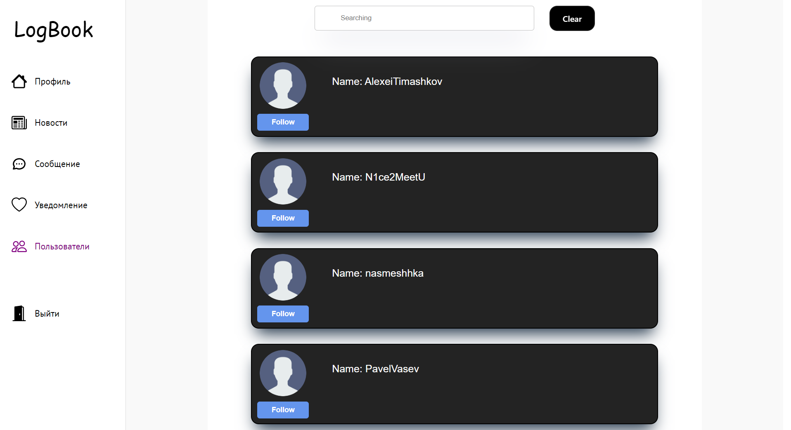

This repository contains the website configuration and documentation supporting the React Redux website.
Login: ad1lek
Password: 123123
## Contents

- [Getting started](#%EF%B8%8F-getting-started)
- [Overview](#-overview)
- [Screenshots](#-screenshots)


## ✈️ Getting started

### Prerequisites

1.  [Git](https://git-scm.com/downloads).
1.  [Node](https://nodejs.org/en/download/) _(version 12 or greater)_.
1.  NPM

### Installation

1.  `cd react-native-website` to go into the project root.
1.  Run `npm` to install the website's workspace dependencies.

### Running locally

1.  `cd website` to go into the website portion of the project.
1.  `npm start` to start the development server _(powered by [Docusaurus](https://v2.docusaurus.io))_.
1.  Open http://localhost:3000/ site in your favorite browser.

## 📖 Overview

### The site was created according to these criteria:
1. Used Functional and Stateful (class-based) components.
2. LocalStorage for SignIn and SignUp
3. Manipulated with forms for controlled and uncontrolled components.
4. Method CRUD. Added Search.
5. REST HTTP. API tools (Fetch API, axios, etc.). React API components.
6. Added components for handling API errors.
7. Lifecycle components.
8. Used React Patterns, Pass Functions as data sources. Used Render-function and Implemented Clone element.
9. High-Order-Components.
10. Context API.
11. React Routes.
12. Used React Hooks.
13. Redux
14. Action Dispatch
15. Container Component and Pure Function.
16. connect(), mapDispatchToProps(), mapStateToProps().
17. Manage React UI (User Interface) for Redux BLL (Business Logic Layer)

## 👏 Screenshots

### WelcomePage:
Connect with localStorage and login. State from Redux -> UsersReducer

<p align="center">
 
</p>

### Profile Page:
Form LocalStorage check currentUser and show.
<br>
Redux store -> usersReducer -> mainUser for showing Profile page. Created a ready user with pictures.
```
let initialState = {
    currentUser: {
        login: "",
        name: "",
        isAuth: false,
        photoProfile: "",
        images: ""
    },
    mainUser: [{
        id: 1,
        followed: false,
        login: "ad1lek",
        name: "Adil Token",
        location: {city: "Almaty", country: "Kazakhstan"},
        photoProfile: "ad1lek.jpeg",
        images: [
            "adil1.jpeg", "adil2.jpeg", "adil3.jpeg"
        ]
    }],
    users: [

    ],
}
```
<br>
<p align="center">
 
</p>

### News Page:
In this page we use CRUD. Used Redux BLL (Business Logic Layer)

<br>
<p align="center">
 
</p>

### Dialogs Page:
Used Redux BLL (Business Logic Layer)
<br>
<p align="center">
 
</p>

### Users Page:
Used Redux BLL (Business Logic Layer)
Using API we took data.

<br>
<p align="center">
 
</p>
